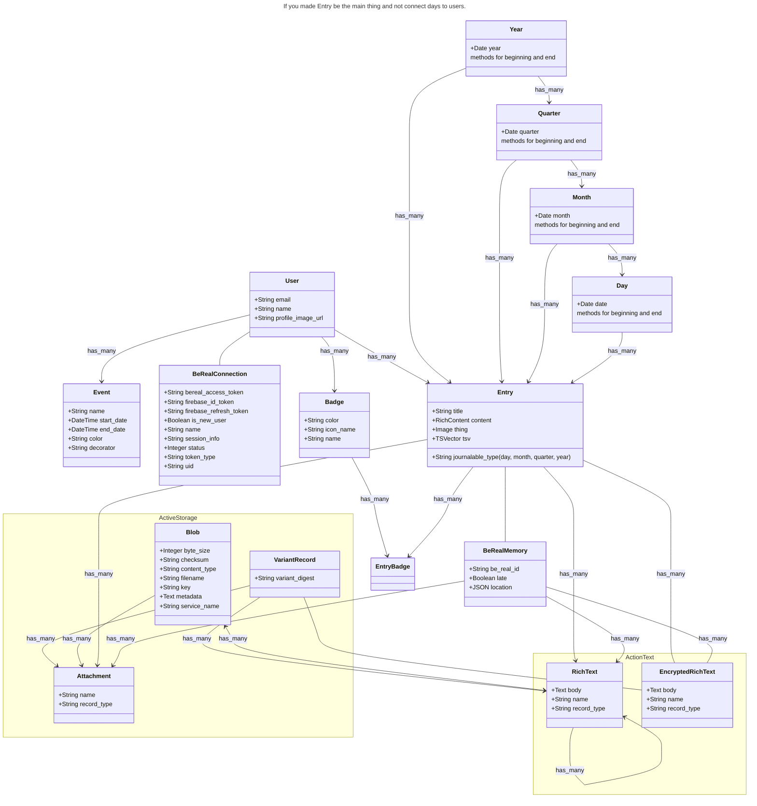

# Remember
The journaling app I've always wanted


Bouta be lit
Stay zen

## Development

### Setup

* `yarn install`
* `bundle install`
* `rails db:create`
* `rails db:setup`

### Environment Variables

You will need to create a `.env_overrides.rb` file and set the following environment variables:

Google Oauth Integration:
```ruby
ENV['GOOGLE_CLIENT_ID'] ||= 'development_client_id_here'
ENV['GOOGLE_CLIENT_SECRET'] ||= 'development_client_secret_here'
```

Rails encryption:
```ruby
ENV['ACTIVE_RECORD_ENCRYPTION_PRIMARY_KEY'] ||= ''
ENV['ACTIVE_RECORD_ENCRYPTION_DETERMINISTIC_KEY'] ||= ''
ENV['ACTIVE_RECORD_ENCRYPTION_KEY_DERIVATION_SALT'] ||= ''
```

### Running the app

`bin/dev`

### Documentation


